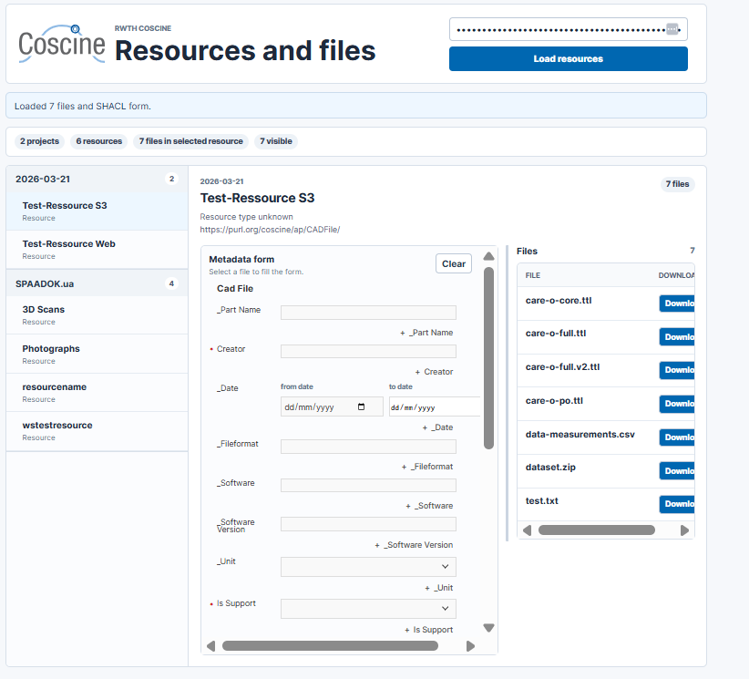

# Coscine Resource Browser

Node and React app for listing RWTH Coscine resources, files, and available file metadata for an API key.

## Run

```bash
npm install
npm run dev
```

Open the Vite URL shown in the terminal, usually `http://localhost:5173`.

The frontend calls a local Express endpoint at `/api/coscine/scan`. The backend uses the same Coscine connection pattern as `TabularRDM`: it sends `Authorization: Bearer <token>` to `https://coscine.rwth-aachen.de/coscine/api/v2`, loads projects first, then loads resources for each project.




## Notes

- Paste only the Coscine API key/token in the UI. If the value already starts with `Bearer`, it is used as-is.
- File metadata is requested from Coscine graph metadata content endpoints for each returned storage item.
